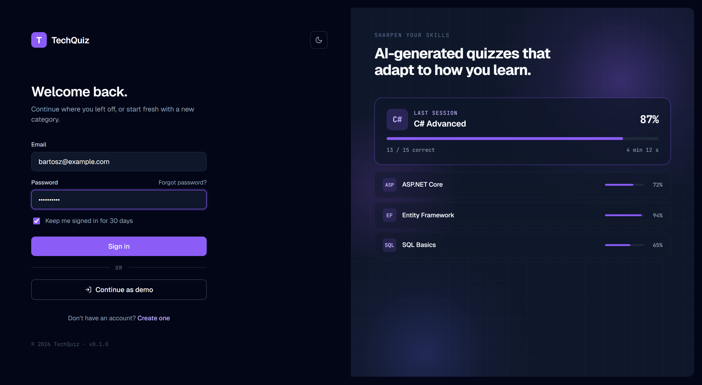
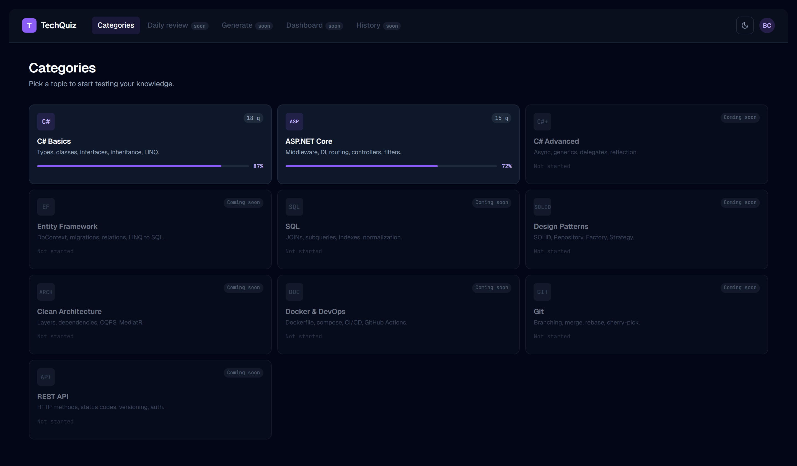
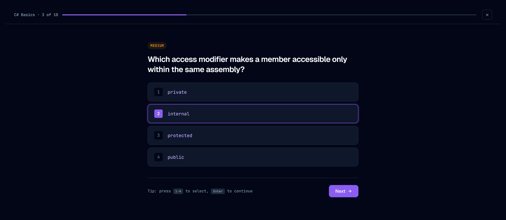
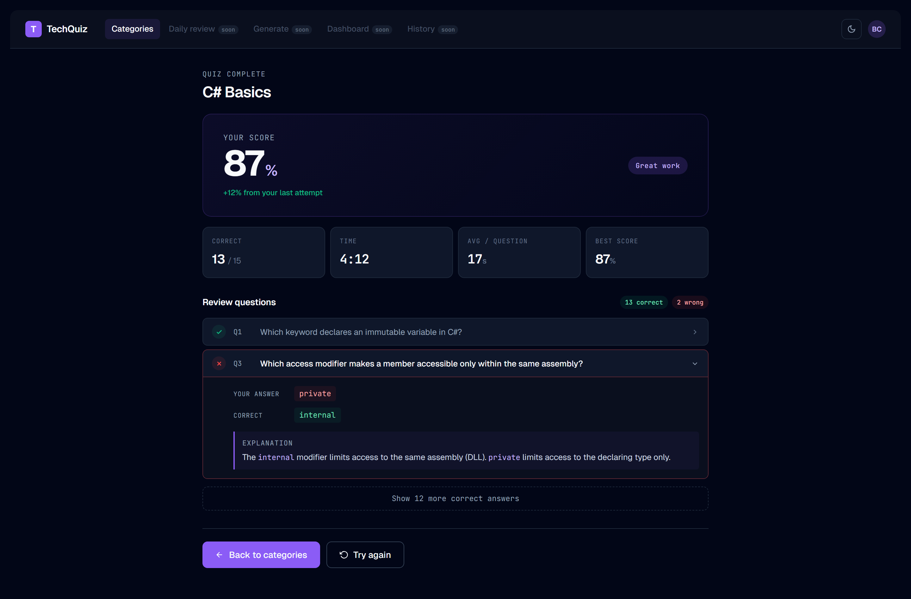
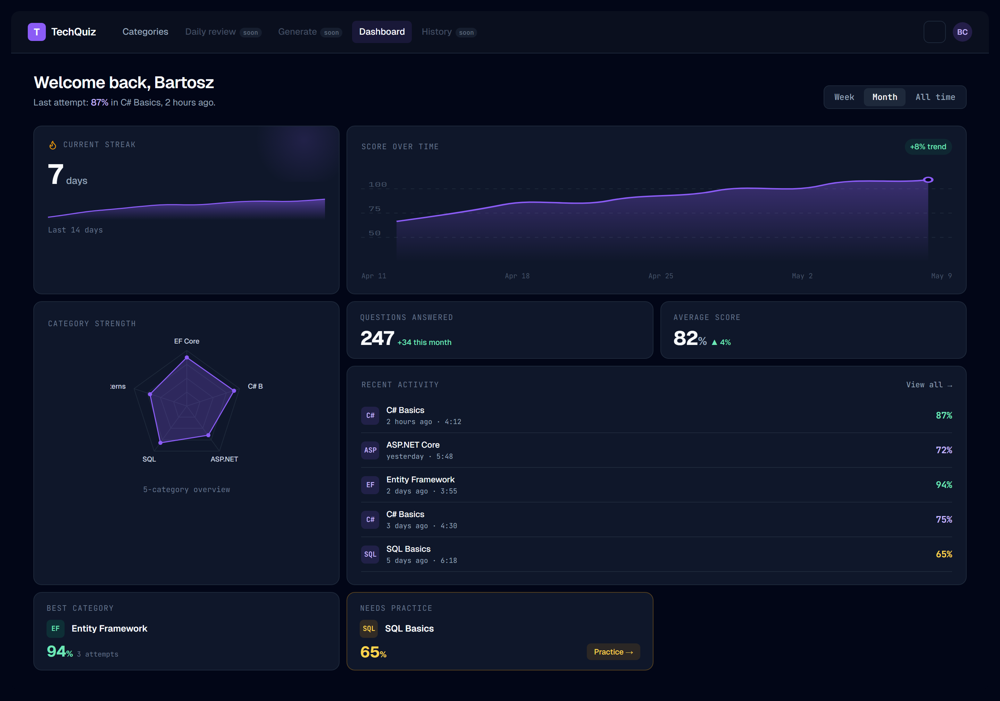
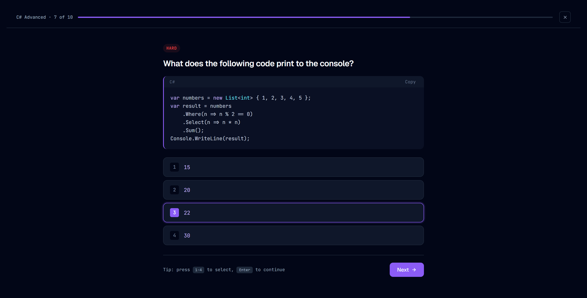

# TechQuiz

> A multi-user platform for testing technical knowledge — with AI-generated questions, spaced repetition, and progress tracking.

<table>
  <tr>
    <td align="center" width="33%"><br/><sub><b>Login</b></sub></td>
    <td align="center" width="33%"><br/><sub><b>Categories</b></sub></td>
    <td align="center" width="33%"><br/><sub><b>Quiz — multiple choice</b></sub></td>
  </tr>
  <tr>
    <td align="center"><br/><sub><b>Result</b></sub></td>
    <td align="center"><br/><sub><b>Dashboard</b> <i>(Phase 2)</i></sub></td>
    <td align="center"><br/><sub><b>Code questions</b> <i>(Phase 3)</i></sub></td>
  </tr>
</table>

<sub>Screenshots are rendered from the design mockups in <a href="docs/mockups/"><code>docs/mockups/</code></a>. Re-generate with <code>pnpm capture-mockups</code>.</sub>

---

TechQuiz is a personal learning platform inspired by Pluralsight Skill IQ. Users test their knowledge across .NET, ASP.NET Core, SQL, design patterns, and other technical topics. AI generates new questions on demand using each user's own API key, and all generated questions are saved to a shared public pool to grow the question bank for everyone.

This is a portfolio project demonstrating Clean Architecture, multi-provider AI integration, full-stack .NET development, and modern frontend practices.

---

## Tech Stack

**Backend**
- ASP.NET Core 9 Web API
- Entity Framework Core 9 + PostgreSQL
- MediatR (CQRS)
- FluentValidation
- ASP.NET Core Identity + JWT bearer auth
- Serilog with structured logging
- xUnit + FluentAssertions + NSubstitute

**Frontend**
- React 19 with TypeScript
- Vite 8
- TanStack Query (Phase 1+)
- React Router v6 (Phase 1+)
- Tailwind CSS v3
- Monaco Editor (Phase 3 — for code questions)
- Recharts (Phase 2 — for progress dashboards)

**AI Integration**
- Multi-provider abstraction (OpenAI, Anthropic Claude, extensible)
- User-supplied API keys, encrypted at rest via ASP.NET Core Data Protection
- Public question pool — AI-generated questions saved for community reuse

**Infrastructure**
- Docker + docker-compose for local development
- Seq for structured log search and observability
- GitHub Actions for CI (build + test on every PR)

---

## Features

### Implemented in MVP (Phase 1)
- Multi-user authentication with JWT
- Quiz flow: select category → answer questions → see results (test mode)
- Backend domain logic developed with TDD
- 269 seed questions across 9 categories (C#/.NET, ASP.NET Core, EF Core, ADO.NET, SQL, Unit Testing, Design Patterns, Front-End, Engineering Practices)
- Demo user with historical quiz attempts for development

### Coming in Phase 2
- Progress dashboard with bento grid layout
- Historical attempt tracking with filters
- Spaced repetition (SM-2 simplified) for review mode
- Per-category statistics and streak counters

### Coming in Phase 3
- AI question generator with multi-provider support
- Encrypted per-user API key vault
- Public AI-generated question pool with community moderation
- Code questions with Monaco Editor (output prediction, bug finding, fill-in)
- AI evaluator for code responses with feedback

### Coming in Phase 4
- Gamification (XP, levels, badges, streaks)
- Email confirmation and password reset
- Production deployment to Render + Neon (staging live; see [`docs/DEPLOYMENT.md`](docs/DEPLOYMENT.md))
- Full CI/CD pipeline with automated testing
- README polish with screenshots and demo GIF

---

## Quick Start

### Prerequisites
- Docker Desktop (with WSL2 backend on Windows)
- Git
- For local development outside Docker: .NET 9 SDK + Node.js 20+ + pnpm 9

### Run the full stack with Docker

```bash
# Clone
git clone https://github.com/bartoszclapinski/TechQuiz.git
cd TechQuiz

# Start all 4 services (API + web + PostgreSQL + Seq)
docker compose up -d

# Verify
curl http://localhost:8085/health        # API → "Healthy"
open http://localhost:5173               # Web → React app
open http://localhost:8081               # Seq log explorer (no auth in dev)
```

Service ports:
- **API** → `http://localhost:8085` (health check at `/health`, OpenAPI at `/openapi/v1.json`)
- **Web** → `http://localhost:5173`
- **PostgreSQL** → `localhost:5433` (user `techquiz` / password `techquiz_dev` / db `techquiz`)
- **Seq UI** → `http://localhost:8081` · ingest → `localhost:5341`

Tear down:
```bash
docker compose down       # stops services, keeps volumes
docker compose down -v    # also wipes postgres + seq data
```

### Run the API locally (without Docker)

The API expects a JWT signing key from `dotnet user-secrets` and a PostgreSQL instance. Start postgres + seq in Docker, then run the API on the host:

```bash
# Set a dev signing key (one-time per machine — anything ≥256 bits base64)
dotnet user-secrets set "Jwt:SigningKey" "$(openssl rand -base64 64)" --project src/TechQuiz.Api

# Start dependencies
docker compose up -d postgres seq

# Run API
dotnet run --project src/TechQuiz.Api
```

### Run the web app locally

```bash
cd web
pnpm install
pnpm dev    # http://localhost:5173 with HMR
```

### Demo credentials

A demo user is seeded automatically on first run (when the categories table is empty), along with all 269 questions:

```
Email:    demo@techquiz.local
Password: DemoPass123!
```

Sign in with these to skip registration and explore the full quiz flow. Re-seeding is a no-op on a non-empty database — to start fresh, run `docker compose down -v`.

---

## Project Structure

```
TechQuiz/
├── TechQuiz.sln
├── global.json                          # pins .NET 9.0.x SDK
├── docker-compose.yml                   # api + web + postgres + seq
├── .editorconfig                        # C# / TS / Markdown style rules
├── commitlint.config.cjs                # conventional-commits enforcement
├── package.json                         # root tooling only (husky + commitlint)
│
├── src/
│   ├── TechQuiz.Domain/                 # Entities, value objects, domain rules (zero framework deps)
│   ├── TechQuiz.Application/            # CQRS handlers, validators, DTOs, ports
│   ├── TechQuiz.Infrastructure/         # EF Core, Identity, repositories, DI registration
│   │   ├── DependencyInjection.cs       # AddInfrastructure(IServiceCollection, IConfiguration)
│   │   └── Persistence/
│   │       ├── AppDbContext.cs          # IdentityDbContext<ApplicationUser>
│   │       └── Identity/ApplicationUser.cs
│   └── TechQuiz.Api/                    # ASP.NET Core Web API + Dockerfile
│
├── tests/
│   ├── TechQuiz.Domain.Tests/           # Pure unit tests (TDD-driven)
│   ├── TechQuiz.Application.Tests/      # Handler tests with mocked repositories
│   └── TechQuiz.Infrastructure.Tests/   # Integration tests with Testcontainers (Phase 1+)
│
├── web/                                 # Vite + React 19 + TypeScript + Tailwind
│   ├── Dockerfile                       # multi-stage: node-alpine → nginx-alpine
│   └── nginx.conf                       # SPA fallback + asset cache rules
│
├── docs/
│   ├── ARCHITECTURE.md                  # System architecture + component patterns
│   ├── DECISION_LOG.md                  # 17 ADRs covering tech + scope + UI decisions
│   ├── CI_CD.md                         # Pipeline behavior + deploy strategy
│   └── mockups/                         # Standalone HTML mockups, dark + light themes
│
├── .ai/                                 # Operational docs for AI assistants
│   ├── ONBOARDING.md
│   └── sprints/sprintN/                 # Per-phase iteration plans + LOG.md
│
└── .github/
    ├── workflows/                       # ci.yml + release.yml
    ├── BRANCH_PROTECTION.md             # Required protection rules (master)
    └── PULL_REQUEST_TEMPLATE.md
```

> Deployment is defined in [`render.yaml`](render.yaml) (Render Blueprint) — see
> [`docs/DEPLOYMENT.md`](docs/DEPLOYMENT.md) for the staging runbook.

See [`docs/ARCHITECTURE.md`](docs/ARCHITECTURE.md) for a detailed technical overview and [`docs/DECISION_LOG.md`](docs/DECISION_LOG.md) for the reasoning behind major decisions.

---

## Development Workflow

This project follows **GitHub Flow** with feature branches and pull requests:

1. Create a branch: `git checkout -b feature/short-description`
2. Make changes following TDD for domain and application layers
3. Push and open a PR
4. Verify CI passes (build + tests)
5. Self-review the diff before merging
6. Squash and merge to `master`

Commits follow the **Conventional Commits** specification, enforced via commitlint:

```
feat: add quiz scoring service
fix: handle null reference in attempt completion
refactor: extract JWT generation from auth controller
test: add edge cases for spaced repetition
docs: update API setup instructions
chore: bump EF Core to 9.0.1
```

---

## Author

**Bartosz Clapinski** — .NET Developer with AI Integration focus

[GitHub](https://github.com/bartoszclapinski) · [LinkedIn](https://linkedin.com/in/bartoszclapinski)

---

## License

MIT
