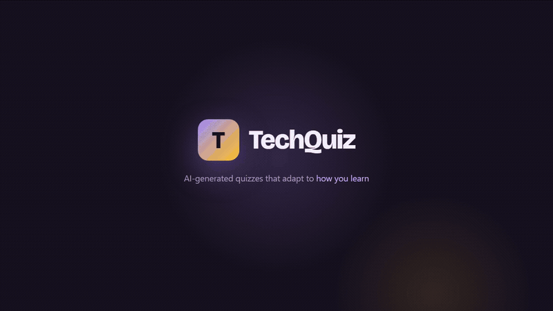

# TechQuiz

> A multi-user platform for testing technical knowledge — with AI-generated questions, spaced repetition, and gamified progress (XP, streaks, Skill IQ).

**▶ Live demo: [techquiz-web.onrender.com](https://techquiz-web.onrender.com)** — click **Continue as demo** to explore the full flow, no sign-up needed. The demo account comes pre-loaded with quiz history. First load can take ~30–50 s while the free Render instance wakes from sleep.

<p align="center">
  
</p>

<p align="center"><sub>Recorded from the live app. The full-length version plays on the <a href="https://techquiz-web.onrender.com/#demo">landing page</a>.</sub></p>

---

TechQuiz is a personal learning platform inspired by Pluralsight Skill IQ. Users test their knowledge across .NET, databases, front-end, and engineering practices, track progress over time, and keep the momentum going with XP, daily streaks and a derived Skill IQ. AI generates new questions on demand using each user's own API key, and all generated questions are saved to a shared public pool to grow the question bank for everyone.

The interface is a warm, dual-theme design system ("Momentum" — violet brand with an amber gamification accent) built to look good from mobile up to UHD. This is a portfolio project demonstrating Clean Architecture, multi-provider AI integration, full-stack .NET development, and modern frontend practices.

> **Note:** public sign-up is currently closed (no privacy policy yet) — use the demo account. The app is live on Render + Neon; see [`docs/DEPLOYMENT.md`](docs/DEPLOYMENT.md).

---

## Tech Stack

**Backend**
- ASP.NET Core 9 Web API
- Entity Framework Core 9 + PostgreSQL
- MediatR (CQRS)
- FluentValidation
- ASP.NET Core Identity + JWT bearer auth
- Serilog with structured logging
- xUnit + FluentAssertions + NSubstitute

**Frontend**
- React 19 with TypeScript
- Vite 8
- TanStack Query (Phase 1+)
- React Router v6 (Phase 1+)
- Tailwind CSS v3 with CSS-variable theming (dual light/dark)
- Bricolage Grotesque / Geist / JetBrains Mono type system
- Monaco Editor (for code questions)
- Route-based code splitting (React.lazy)

**AI Integration**
- Multi-provider abstraction (OpenAI, Anthropic Claude, extensible)
- User-supplied API keys, encrypted at rest via ASP.NET Core Data Protection
- Public question pool — AI-generated questions saved for community reuse

**Infrastructure**
- Docker + docker-compose for local development
- Seq for structured log search and observability
- GitHub Actions for CI (build + test on every PR)

---

## Features

### Core quiz platform (Phase 1)
- Multi-user authentication with JWT (memory-only access token + HttpOnly refresh cookie)
- Quiz flow: pick a topic → answer → see results with per-question review and explanations
- Backend domain + application logic developed with TDD
- 269 seed questions organised as a **Track → Category → Quiz** taxonomy — 4 tracks (.NET, Databases, Front-End, Engineering Practices) over 18 categories

### Dashboard & review (Phase 2)
- Progress dashboard as a bento grid (streak, accuracy, category strength, weekly activity, recent attempts)
- Historical attempt tracking with filters and per-attempt review
- Spaced repetition (simplified SM-2) daily-review mode with its own stats
- Achievement badges

### AI & code questions (Phase 3)
- AI question generator with a multi-provider abstraction (OpenAI, Anthropic Claude, extensible)
- Encrypted per-user API key vault (ASP.NET Core Data Protection)
- Public AI-generated question pool for community reuse
- Code questions with Monaco Editor

### Polish & production (Phase 4)
- **Live** on Render + Neon with GitHub Actions CI (build + test on every PR)
- "Momentum" visual redesign — dual-theme design system, mobile → UHD
- **Gamification**: XP, levels, daily streaks, and a derived Skill IQ (all computed from your attempts)
- Accessibility pass (keyboard focus, skip link, WCAG AA contrast, semantics/ARIA)
- Demo account seeded with a fresh, self-refreshing quiz history; public registration gated behind a config flag

---

## Quick Start

### Prerequisites
- Docker Desktop (with WSL2 backend on Windows)
- Git
- For local development outside Docker: .NET 9 SDK + Node.js 20+ + pnpm 9

### Run the full stack with Docker

```bash
# Clone
git clone https://github.com/bartoszclapinski/TechQuiz.git
cd TechQuiz

# Start all 4 services (API + web + PostgreSQL + Seq)
docker compose up -d

# Verify
curl http://localhost:8085/health        # API → "Healthy"
open http://localhost:5173               # Web → React app
open http://localhost:8081               # Seq log explorer (no auth in dev)
```

Service ports:
- **API** → `http://localhost:8085` (health check at `/health`, OpenAPI at `/openapi/v1.json`)
- **Web** → `http://localhost:5173`
- **PostgreSQL** → `localhost:5433` (user `techquiz` / password `techquiz_dev` / db `techquiz`)
- **Seq UI** → `http://localhost:8081` · ingest → `localhost:5341`

Tear down:
```bash
docker compose down       # stops services, keeps volumes
docker compose down -v    # also wipes postgres + seq data
```

### Run the API locally (without Docker)

The API expects a JWT signing key from `dotnet user-secrets` and a PostgreSQL instance. Start postgres + seq in Docker, then run the API on the host:

```bash
# Set a dev signing key (one-time per machine — anything ≥256 bits base64)
dotnet user-secrets set "Jwt:SigningKey" "$(openssl rand -base64 64)" --project src/TechQuiz.Api

# Start dependencies
docker compose up -d postgres seq

# Run API
dotnet run --project src/TechQuiz.Api
```

### Run the web app locally

```bash
cd web
pnpm install
pnpm dev    # http://localhost:5173 with HMR
```

### Demo credentials

A demo user is seeded automatically on startup, along with all 269 questions across the four tracks:

```
Email:    demo@techquiz.local
Password: DemoPass123!
```

Public registration is closed (see the note up top), so the demo account is the way in — the login screen also has a **Continue as demo** button. The demo account's quiz history is **refreshed on every startup** (dates relative to now), so the dashboard always shows a populated, current-looking state. Category/question seeding is idempotent; to reset everything locally, run `docker compose down -v`.

---

## Project Structure

```
TechQuiz/
├── TechQuiz.sln
├── global.json                          # pins .NET 9.0.x SDK
├── docker-compose.yml                   # api + web + postgres + seq
├── .editorconfig                        # C# / TS / Markdown style rules
├── commitlint.config.cjs                # conventional-commits enforcement
├── package.json                         # root tooling only (husky + commitlint)
│
├── src/
│   ├── TechQuiz.Domain/                 # Entities, value objects, domain rules (zero framework deps)
│   ├── TechQuiz.Application/            # CQRS handlers, validators, DTOs, ports
│   ├── TechQuiz.Infrastructure/         # EF Core, Identity, repositories, DI registration
│   │   ├── DependencyInjection.cs       # AddInfrastructure(IServiceCollection, IConfiguration)
│   │   └── Persistence/
│   │       ├── AppDbContext.cs          # IdentityDbContext<ApplicationUser>
│   │       └── Identity/ApplicationUser.cs
│   └── TechQuiz.Api/                    # ASP.NET Core Web API + Dockerfile
│
├── tests/
│   ├── TechQuiz.Domain.Tests/           # Pure unit tests (TDD-driven)
│   ├── TechQuiz.Application.Tests/      # Handler tests with mocked repositories
│   └── TechQuiz.Infrastructure.Tests/   # Integration tests with Testcontainers (Phase 1+)
│
├── web/                                 # Vite + React 19 + TypeScript + Tailwind
│   ├── Dockerfile                       # multi-stage: node-alpine → nginx-alpine
│   └── nginx.conf                       # SPA fallback + asset cache rules
│
├── docs/
│   ├── ARCHITECTURE.md                  # System architecture + component patterns
│   ├── DECISION_LOG.md                  # 26 ADRs covering tech + scope + UI decisions
│   ├── CI_CD.md                         # Pipeline behavior + deploy strategy
│   ├── DEPLOYMENT.md                    # Render + Neon runbook
│   ├── media/                           # Walkthrough GIF used above
│   └── mockups/                         # Standalone HTML mockups, dark + light themes
│
├── .ai/                                 # Operational docs for AI assistants
│   ├── ONBOARDING.md
│   └── sprints/sprintN/                 # Per-phase iteration plans + LOG.md
│
└── .github/
    ├── workflows/                       # ci.yml + release.yml + api-smoke.yml
    ├── BRANCH_PROTECTION.md             # Required protection rules (master)
    └── PULL_REQUEST_TEMPLATE.md
```

> Deployment is defined in [`render.yaml`](render.yaml) (Render Blueprint) — see
> [`docs/DEPLOYMENT.md`](docs/DEPLOYMENT.md) for the staging runbook.

See [`docs/ARCHITECTURE.md`](docs/ARCHITECTURE.md) for a detailed technical overview and [`docs/DECISION_LOG.md`](docs/DECISION_LOG.md) for the reasoning behind major decisions.

---

## Development Workflow

This project follows **GitHub Flow** with feature branches and pull requests:

1. Create a branch: `git checkout -b feature/short-description`
2. Make changes following TDD for domain and application layers
3. Push and open a PR
4. Verify CI passes (build + tests)
5. Self-review the diff before merging
6. Squash and merge to `master`

Commits follow the **Conventional Commits** specification, enforced via commitlint:

```
feat: add quiz scoring service
fix: handle null reference in attempt completion
refactor: extract JWT generation from auth controller
test: add edge cases for spaced repetition
docs: update API setup instructions
chore: bump EF Core to 9.0.1
```

---

## Author

**Bartosz Clapinski** — .NET Developer with AI Integration focus

[GitHub](https://github.com/bartoszclapinski) · [LinkedIn](https://linkedin.com/in/bartoszclapinski)

---

## License

MIT
